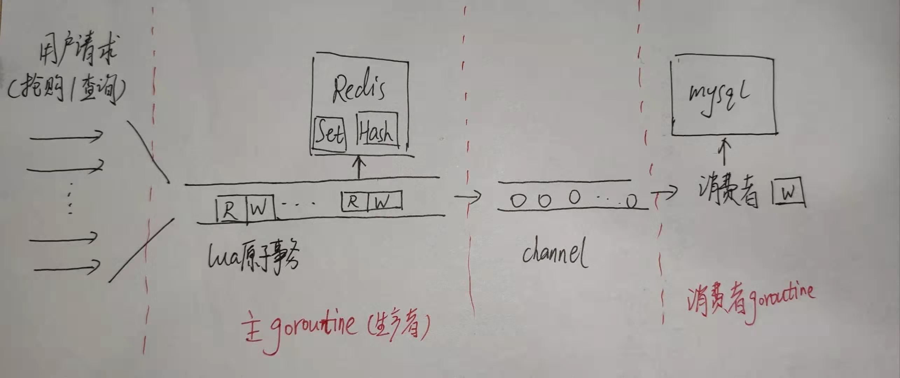
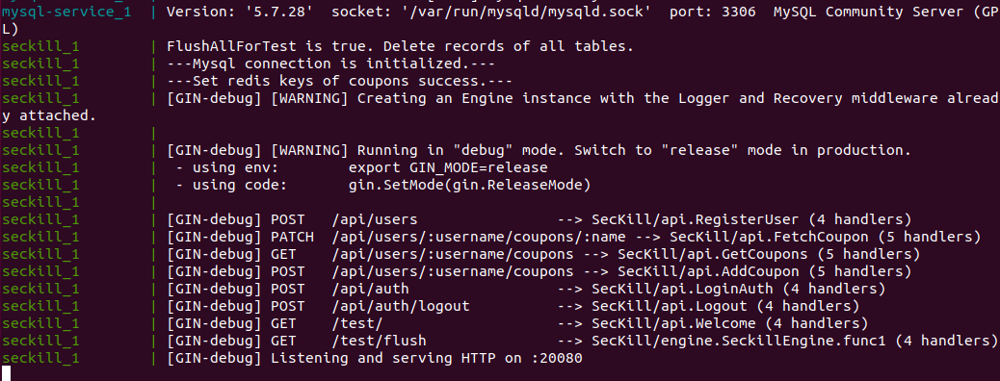
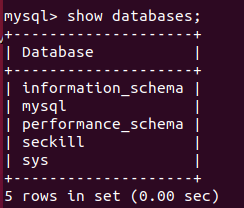
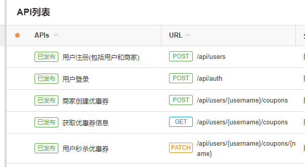

[TOC]

# 课程项目要求

[说明文档](https://shimo.im/docs/9vtcTDHJDYQr8xVp/read)	[接口文档](https://www.eolinker.com/#/share/index?shareCode=2Y2Zkd)

提交：docker-compose文件以及实验报告。

# 系统环境

ubuntu 18 （Oracle VirtualBox虚拟机）

go 1.13.5 linux/amd64

docker CE 19.03.5

docker-compose 1.25.0

# 系统结构

 


# 开始

首先安装上述环境，还有IDE：goland，安装方法参考

- [ubuntu安装golang和goland](https://blog.csdn.net/weixin_41519463/article/details/103463808)
- [Docker基础知识和使用示例](https://blog.csdn.net/weixin_41519463/article/details/103450911)
- [Docker-Compose介绍、安装及使用](https://blog.csdn.net/weixin_41519463/article/details/103472297)

下面先讲如何启动服务进行测试（TA评分用），再讲如何项目实现细节。

## 一、只跑服务，不理会实现细节

### 1、启动服务

这部分是上交项目后，TA测试评分用的，只需要项目中的`docker-compose.yml`文件即可：

```yaml
version: "2"
services:
  mysql-service:
    image: mysql:5.7
    ports:
      - "23306:3306"
    restart: 'always'
    environment:
      MYSQL_ROOT_PASSWORD: "root"
      MYSQL_DATABASE: "seckill"
  redis-service:
    image: redis
    command: redis-server --requirepass 123456
    ports:
      - "6379:6379"
    restart: 'always'
  seckill:
    restart: 'always'
    image: registry.cn-shenzhen.aliyuncs.com/karlhjm/seckill:0.1.3
    ports:
      - "20080:20080"
    links:
      - mysql-service:mysql
      - redis-service:redis
```

直接运行命令即可启动服务。

```bash
sudo docker-compose up
```

docker-compose会拉取mysql、redis、seckill三个服务的镜像（会比较慢）、以容器的形式运行并且将他们关联起来。

> docker-compose命令需要root权限。
>
> 解决拉取镜像慢的方法：[ubuntu中拉取docker镜像速度缓慢的解决方法, 好实用](https://blog.csdn.net/weixin_44066250/article/details/89020880)

命令完成后，三个服务都已启动（只截取seckill部分）：

此时docker中多了三个镜像和三个容器：


端口映射：

比如mysql部分的端口映射代表了mysql容器的3306端口绑定了本地的23306端口，如果本地要访问容器中的mysql服务，就需要使用地址0.0.0.0和端口23306。

### 2、访问mysql和redis服务

首先查看一下mysql和redis服务的情况。

#### 访问容器中的mysql服务

首先本地要先安装mysql

> 参考[Ubuntu 安装mysql和简单操作](https://www.cnblogs.com/lfri/p/10437694.html)
>
> 安装：
>
> ```bash
> sudo apt-get install mysql-server          #服务端
> sudo apt-get install mysql-client          #客户端，这里其实只安装客户端就可以了
> ```
>
> 验证安装：
>
> ```bash
> apt-get install net-tools
> sudo netstat -tap | grep mysql
> ```
>
> 如果看到有mysql 的socket处于 listen 状态则表示安装成功。

访问容器中mysql服务的命令：
```bash
mysql -uroot -h 0.0.0.0 -P23306 -proot
```

> mysql的账户密码都为为root，如果不允许在命令行上直接写密码，可以换用命令`mysql -uroot -h 0.0.0.0 -P23306 -p`，然后再输入密码root。

在mysql服务中查看数据库和数据表：

```mysql
show databases; 
use seckill; 
show tables;
quit;
```



可见数据库seckill中有两个数据表coupons存放优惠券数据，users存放用户数据。此外可以用命令`select * from users;`查看数据表中的数据，但因为刚启动服务，所以两个都是空表。

#### 访问容器中的redis服务

首先本地安装redis客户端

```bash
apt install redis-tools
```

本地访问容器中的redis服务，并且用`PING`命令检测redis服务是否已启动：

```bash
redis-cli -h 127.0.0.1 -p 6379 -a 123456
```


> 参考[Redis 命令](https://www.runoob.com/redis/redis-commands.html)

输入命令`keys *`查看 redis 中所有的 key ：

可见redis中也是空的。

#### 开发过程中使用mysql和redis服务的方式

值得注意的是，在进行项目开发的时候，我们是用镜像和容器启动mysql、redis服务，然后通过本地安装好的mysql和redis客户端来访问这两个服务（主要是有时用来查看其中的数据内容）；然后在本地用goland这个IDE开发seckill项目，开发完毕后写Dockerfile将seckill项目打包成镜像，push到阿里云的dockerhub上，最后编写docker-compose.yml文件将三个任务关联起来（三个任务的镜像都是从网上拉取下来的）。

> 一开始的时候，我们开发完项目后没有上传到dockerhub上，这时docker-compose.yml只能是从网上拉取mysql和redis镜像，然后本地通过调用Dockerfile构建seckill镜像。但是这样的话，就没法上交作业，因为作业只能有个docker-compose.yml文件而不能有项目代码，所以后来就先构建好seckill镜像上传到dockerhub上，然后docker-compose.yml从网上拉取三个镜像就ok了，不需要项目代码。


### 3、接口测试

相关接口测试的代码都放在httptest目录下，使用方法参考[Gin - 高性能 Golang Web 框架的介绍和使用](https://github.com/zhongzhh8/Notes/blob/master/Gin - 高性能 Golang Web 框架的介绍和使用.md)的最后一个小节，详细讲述了如何使用 Go 官方包 `net/http/httptest` 来测试项目接口。

测试过程略。


### 4、并发测试

测试工具：jmeter or postman

**步骤**

1. 创建普通用户
2. 创建商家
3. 商家登录，创建优惠券
4. 用户秒杀过程
   - 用户登录
   - 查询优惠券
   - 用户秒杀
   - 查询优惠券

测试过程略。


## 二、项目开发的技术实现细节

GoLand里要这样设置

才能顺利import用到的各种库文件。

下面逐个讲解各代码文件的作用，按照这个顺序来看可以理解整个项目的思路。

### 1、server.go

首先是包含main函数的`server.go`文件，项目从这里开始执行。值得注意的是，在这个代码文件中，`import "SecKill/engine"`把路由和处理函数导入进来，`import "SecKill/data"`把负责数据处理的data包导入进来，data包中有三个代码文件：`init.go`、`mysql.go`、`redis.go`，其中在`init.go`中包含init()函数

```go
func init()  {
	config, err := conf.GetAppConfig()
	if err != nil {
		panic("failed to load data config: " + err.Error())
	}

	initMysql(config)
	initRedisConnection(config)
}
```

go默认执行此初始化函数，其中先后调用`mysql.go`、`redis.go`文件中的initMysql和initRedisConnection函数来初始化mysql和redis，即设置参数、建立连接，具体可以看`mysql.go`、`redis.go`文件中的代码。

具体可参考[go语言中的init()函数和main()函数](https://www.jianshu.com/p/532ebcc8df9b)，总的来说就是先初始化mysql和redis的连接，然后再启动应用。

main函数里面只包含以下内容：

1. 注册路由和对应的处理函数（具体写在`secKill.go`文件里）

2. 
   绑定端口20080，然后启动应用
   

下面接着讲解路由设置部分。


### 2、engine/secKill.go

`secKill.go`中的SeckillEngine函数写的主要是设置路由以及调用函数启动消费者goroutine。

#### 设置路由

这部分路由设置只需要严格按照接口文档来写就ok了。

[接口文档](https://www.eolinker.com/#/share/index?shareCode=2Y2Zkd)：



对应的路由设置：

```go
userRouter := router.Group("/api/users")
userRouter.POST("", api.RegisterUser) //注册
userRouter.Use(jwt.JWTAuth())//这些请求都需要通过jwt做用户授权
{
    userRouter.PATCH("/:username/coupons/:name", api.FetchCoupon)
    userRouter.GET("/:username/coupons", api.GetCoupons)
    userRouter.POST("/:username/coupons", api.AddCoupon)
}

authRouter := router.Group("/api/auth") //登录和注销
{
    authRouter.POST("", api.LoginAuth)
    authRouter.POST("/logout", api.Logout)
}
```

然后还有启动秒杀功能的消费者goroutine（用来异步更新数据库）

```go
api.RunSecKillConsumer()
```

接下来先后分别讲解启动消费者goroutine、JWT认证授权、各个路由接口的处理。


### 3、api/mq.go

在RunSecKillConsumer函数中使用go关键字开启一个消费者goroutune，用以接收redis的改动信息，更新数据库

```go
go seckillConsumer()
```

这里主要是用到了go的CSP并发模型，参考[Go的CSP并发模型（goroutine + channel）](https://blog.csdn.net/weixin_41519463/article/details/103848698)，简单来说，主goroutine扮演生产者角色，处理用户抢购请求，每当一个用户抢购成功后，就更新redis中的数据。此时为了将数据更新持久化到数据库中（保持redis与数据库的数据一致性），就需要接着更新数据库，但是如果在主goroutine中更新数据库，则主goroutine不得不等待缓慢的数据库访问。为了避免这种情况，就需要新开一个消费者goroutine，然后通过有缓存的channel来进行二者之间的通信。总的来说，就是生产者每次更新完redis后，将这个消息送到channel中，接着马上去处理下一个用户抢购请求。由于主goroutine不需要等待数据库更新，所以可以发挥redis高速读写的特性，更好的支持高并发请求。消费者goroutine这边则是一直监听channel，发现有消息后拿到消息，然后更新数据库。也就是说主goroutine与消费者goroutine并行执行，redis与数据库的更新是异步执行、互不干扰的。

函数seckillConsumer()中描述了消费者goroutine如何从channel中读取信息，更新数据库（就是当redis中优惠券数量减一时，就让数据库也减一）。

定义channel：

```go
const maxMessageNum = 20000
var SecKillChannel = make(chan secKillMessage, maxMessageNum) //有缓存的channel
```

其中消息的结构为：

```go
type secKillMessage struct {
	username string
	coupon model.Coupon
}
```


### 4、middleware/jwt/jwt.go

这部分主要是做用户授权。原理参考[JSON Web令牌（JWT）](https://blog.csdn.net/weixin_41519463/article/details/103843702)。代码实现颇为复杂，基本都是参考网上的代码来实现的，这里就不细说了。其实原本用session的话更简单，gin原本就有相关session的包，实现起来更方便，但是TA要求用jwt，没有办法，只能改成用jwt。

接下来再讲解各个路由接口的实现细节。


### 5、用户注册、登录和注销

不是高并发业务所以不需要用到redis，只与mysql交互。

**注册**：`api/users.go`中的RegisterUser函数，无非就是检查请求中的用户名和密码是否符合规范、将密码用MD5算法加密，然后写入到数据库中的users表中。（这里应该还要写入redis的，当时写代码漏掉了）

**登录**：`api/auth.go`中的LoginAuth函数，查找用户、匹配密码（先用MD5编码再去匹配）、调用jwt生成令牌（token），最后把令牌附在Header上返回响应。

**注销**：`api/auth.go`中的Logout函数，原本是用作删除redis中的session的，但是由于TA要求使用jwt令牌，所以这个函数现在相当于名存实亡。


### 6、商家添加优惠券

不是高并发业务，原本是不需要用到redis，只与mysql交互的，但是出于提前预热的目的，要把优惠券也加入redis中，应对后面的高并发抢购请求。

`api/users.go`中的AddCoupon函数，处理步骤如下

1. 检查请求的Header上的令牌，如果没有令牌说明还没有登录，如果有令牌就接着检查用户类型是否是商家。
2. 检查请求的参数，比如登录用户名与要求添加的优惠券所属的商家名是否相同，就是说不能给别的商家添加优惠券之类的。
3. 在数据库coupons表中添加优惠券。
4. 调用redisService包中的CacheCouponAndHasCoupon函数，在redis中添加优惠券，相当于提前把优惠券放到redis上，后面抢购的时候就不用先访问mysql了。


### 7、查询优惠券

查询优惠券是高并发业务，需要用到redis，因为随着抢购的进行，redis中的优惠券数量是在变动的，这时查询优惠券，需要查询redis中的优惠券才准确（数据库中的更新是有延迟的）。

这里涉及到两个用户名，分别是登录用户名和查询用户名。

`api/users.go`中的GetCoupons函数，处理步骤如下

1. 检查请求的Header上的令牌，如果没有令牌说明还没有登录。
2. 检查请求的参数格式。
3. 在数据库中查找查询用户名对应的用户，因为后面需要判断用户的类别是商家还是普通用户。（这里大错特错，应该是去redis里查才对，但是当时写代码的时候疏忽大意，搞成了查数据库，导致高并发测试的效果变差了）
4. 判断用户权限，比如说用户可以查自己和商家的优惠券，但是不能查其他用户的优惠券之类的 。
5. 用户有权查询，则在redis中查询优惠券数。

值得注意的是，原本的代码里查找查询的用户是否存在，是用的这个代码


然后提交给TA去测试了，结果跟第一名相同的原理，我们只拿了第二名。后来重温、整理代码的时候才发现了这个问题，这里不应该查询数据库，而应该是查redis才对。因为这里是在主goroutine，处理高并发请求，绝不能去访问数据库，只能访问redis。所以应该改成，在用户注册时不仅写入数据库，还要写入redis里。然后这里查找查询的用户，再到redis里查。


### 8、用户秒杀优惠券

最重点的部分来了。秒杀请求是最主要的高并发事务。

`api/users.go`中的FetchCoupon函数，处理步骤如下：

1. 检查请求的Header上的令牌，如果没有令牌说明还没有登录。如果有令牌但用户类型为商家，则无权限抢优惠券。
2. 调用redisService包的CacheAtomicSecKill函数，完成原子性抢购业务（redis部分在后面详细讲）。
3. 抢购成功后，将redis中的对于优惠券数减一
4. 更新完redis后，将信息放入channel中，加给消费者goroutine完成数据库更新。


### 9、Redis部分

redis的初始化、连接建立、加载lua脚本、添加记录等操作都，写在`data/redis.go`中。而与项目相关的redis函数写在`api/redisService`包下。


#### 初始化

首先看`api/redisService/init.go`中的初始化函数：

首先让redis加载秒杀的lua脚本，PrepareScripth函数主要是确保redis加载lua脚本，若未加载则加载。

lua脚本如下：

```go
const secKillScript = `
    -- Check if User has coupon
    -- KEYS[1]: hasCouponKey "{username}-has"
    -- KEYS[2]: couponName   "{couponName}"
    -- KEYS[3]: couponKey    "{couponName}-info"
    -- 返回值有-1, -2, -3, 都代表抢购失败
    -- 返回值为1代表抢购成功

    -- Check if coupon exists and is cached
	local couponLeft = redis.call("hget", KEYS[3], "left");
	if (couponLeft == false)
	then
		return -2;  -- No such coupon
	end
	if (tonumber(couponLeft) == 0)  --- couponLeft是字符串类型
    then
		return -3;  --  No Coupon Left.
	end

    -- Check if the user has got the coupon --
	local userHasCoupon = redis.call("SISMEMBER", KEYS[1], KEYS[2]);
	if (userHasCoupon == 1)
	then
		return -1;
	end

    -- User gets the coupon --
	redis.call("hset", KEYS[3], "left", couponLeft - 1);
	redis.call("SADD", KEYS[1], KEYS[2]);
	return 1;
`
```

Redis2.6以后就内嵌了Lua脚本功能，

> 参考[Lua 基本语法](https://www.runoob.com/lua/lua-basic-syntax.html)，[Go语言中通过Lua脚本操作Redis的方法](https://www.zhangshengrong.com/p/LKa4D4vbaQ/)

两个减号是单行注释，脚本先后执行了以下任务：

1. 检查此类型优惠券在redis中是否存在、检查此优惠券是否还有剩余。
2. 检查该用户是否已经拥有此优惠券（一个用户，每种优惠券只能有一张）。
3. 该用户获取一张优惠券。

可见脚本将check和set命令结合成一个原子性事务，避免了临界区问题。

加载完lua脚本后，执行函数preHeatKeys将数据加载到缓存预热，防止缓存穿透。就是先从数据库中查询出所有优惠券记录，然后都通过CacheCouponAndHasCoupon函数写进Redis中：

1. 我们这里用到redis的set集合，对于当前优惠券，它的用户对应的key为`coupon.Username-has`，使用redis的SetAdd命令将`coupon.CouponName`这一个记录添加到Set集合`coupon.Username-has`中。Set集合的作用是，记录用户拥有的优惠券名字，后面用来防止一个用户抢两次相同优惠券。比如可能有这两个Set集合：

   ```go
   Alice-has={coupon1, coupon2}
   Bob-has={coupon1, coupon3}
   ```

2. 我们这里用到redis的hash表，根据当前优惠券的username，从数据库中查询出这个用户出来，判断他是否是商家，如果是，就在redis中新建一个哈希记录(`coupon.CouponName-info`,`fields`)，其中这个`fields`指的是优惠券的map格式的完整详细信息：

   ```go
   fields := map[string]interface{}{
   		"id": coupon.Id,
   		"username": coupon.Username,
   		"couponName": coupon.CouponName,
   		"amount": coupon.Amount,
   		"left": coupon.Left,
   		"stock": coupon.Stock,
   		"description": coupon.Description,
   	}
   ```

   用redis的HMSet命令将这个记录添加到redis的哈希表中。比如哈希表内容可能是：

   ```go
   HashList={{"coupon1":coupon1_fileds_map}, {"coupon2":coupon2_fileds_map},...}
   ```

总的来说，预热部分往redis中添加了Set记录和Hash记录，其中Set记录写的是该用户拥有的优惠券，Hash记录写的是（优惠券，详细信息）。然而实际上，项目刚从零启动，redis初始化的时候database里是空的，这里的预热实际上没有往redis里写任何东西。只有在项目已经运行了一段时间，响应过一些请求，数据库里已经有优惠券之后，再重启应用或者重新调用这个预热函数，才会将所有优惠券信息放上redis中。

用到redis的场合无非是AddCoupon、GetCoupons和FetchCoupon三个接口，接下来分别讲解各个接口如何使用redis。

#### AddCoupon

主要的事务处理前面的小节已经讲过了，这里关注的是在Redis添加优惠券的部分。

```go
// 在Redis添加优惠券
if err = redisService.CacheCouponAndHasCoupon(coupon); err != nil {
    log.Println("Create Cache failed. ", err.Error())
    ctx.JSON(http.StatusInternalServerError, gin.H{
        ErrMsgKey: "Create Cache failed. " + err.Error()})
    return
}
```

可见就是调用redisService包的CacheCouponAndHasCoupon函数，预热时也有调用过这个函数来将优惠券添加到redis中，处理过程是相同的，就是往redis中添加（持有者，优惠券）Set记录和（优惠券，详细信息）Hash记录。


#### GetCoupons

这里面有两个用户名，分别是登录用户名以及要查询的优惠券的持有者的用户名（查询用户名）。首先要再redis中查找查询用户名对应的用户，获取他的用户类别属性。但是由于当时写错了，写成查数据库，所以这里没有写。

然后调用redisService.GetCoupons函数查找查询用户拥有的所有优惠券：

```go
// 从缓存获取某个用户的所有优惠券
func GetCoupons(userName string) ([]model.Coupon, error) {
	var coupons []model.Coupon
	hasCouponsKey := getHasCouponsKeyByName(userName)
	couponNames, err := data.GetSetMembers(hasCouponsKey)
	if err != nil {
		println("Error when getting coupon members. " + err.Error())
		return nil, err
	}
	// TODO: 使用数组, 不使用slice append
	for _, couponName := range couponNames {
		coupon := GetCoupon(couponName)
		coupons = append(coupons, coupon)
	}
	return coupons, nil
}
```

首先获取对应的key：`coupon.userName-has`，使用Redis Smembers 命令返回该`coupon.userName-has`集合中的所有的成员，其实就是看该用户拥有的所有优惠券。这一步也只是拿到用户拥有的优惠券名而已，为了获取优惠券的完整详细信息，还需要调用GetCoupon函数，从Hash表中查询出优惠券的完整信息：

```go
key := getCouponKeyByName(couponName)
values, err := data.GetMap(key, "id", "username", "couponName", "amount", "left", 		 "stock", "description")
//...省略格式检查和转换
return model.Coupon{
    Id:          id,
    Username:    values[1].(string),
    CouponName:  values[2].(string),
    Amount:      amount,
    Left:        left,
    Stock:       stock,
    Description: values[6].(string),
}
```

其实就是先得到优惠券对应的key：`coupon.couponName-info`，然后使用redis的HMGet命令，根据key查找出优惠券对应的详细信息，然后返回。

拿到了查询出来的优惠券，还要调用ParseSellerResCoupons或者ParseCustomerResCoupons函数对优惠券信息进行解析（其中商家可以看到优惠券剩余数量，用户不能看到）


#### FetchCoupon

重点看这部分与redis的交互：

```go
// ---用户抢优惠券。后面需要高并发处理---
// 先在缓存执行原子性的秒杀操作。将原子性地完成"判断能否秒杀-执行秒杀"的步骤
_, err := redisService.CacheAtomicSecKill(claims.Username, paramSellerName, paramCouponName)
if err == nil {
    //log.Println(fmt.Sprintf("result: %d", secKillRes))
    coupon := redisService.GetCoupon(paramCouponName)
    // 交给[协程]完成数据库写入操作
    SecKillChannel <- secKillMessage{claims.Username, coupon}
    ctx.JSON(http.StatusCreated, gin.H{ErrMsgKey: ""})
    return
} else {
    if redisService.IsRedisEvalError(err) {
        log.Printf("Server error" + err.Error())
        ctx.JSON(http.StatusInternalServerError, gin.H{ErrMsgKey: err.Error()})
        return
    } else {
        //log.Println("Fail to fetch coupon. " + err.Error())
        ctx.JSON(http.StatusNoContent, gin.H{})
        return
    }
```

##### （1）秒杀事务

首先是调用redisService.CacheAtomicSecKill执行原子性的秒杀事务。这是最关键的函数：

```go
// 尝试在redis进行原子性的秒杀操作
func CacheAtomicSecKill(userName string, sellerName string, couponName string) (int64, error) {
	// 根据sha，执行预先加载的秒杀lua脚本
	userHasCouponsKey := getHasCouponsKeyByName(userName)
	couponKey := getCouponKeyByName(couponName)
	res, err := data.EvalSHA(secKillSHA, []string{userHasCouponsKey, couponName, couponKey})
	if err != nil {
		return -1, redisEvalError{}
	}

	// 该lua脚本应当返回int值
	couponLeftRes, ok := res.(int64)
	if !ok {
		return -1, CouponLeftResError{res}
	}

	// 此处的-1, -2, -3 和 >=0的判断依据, 与secKillSHA变量lua脚本的返回值保持一致
	// 请看secKillSHA
	switch {
	case couponLeftRes == -1:
		return -1, userHasCouponError{userName, couponName}
	case couponLeftRes == -2:
		return -1, noSuchCouponError{sellerName, couponName}
	case couponLeftRes == -3:
		return -1, noCouponLeftError{sellerName, couponName}
	case couponLeftRes == 1:  // left为0时, 就是存量为0, 那就是没抢到, 也可能原本为1, 抢完变成了0.
		return couponLeftRes, nil
	default: {
		log.Fatal("Unexpected return value.")
		return -1, CouponLeftResError{couponLeftRes}
	}

	}
}
```

传入的参数有userName（登录用户名），sellerName（要抢的优惠券对应的商家名）和couponName（优惠券名），首先根据username和couponName获取对应的key，然后调用redis的函数EvalSha执行初始化时已经预加载好的lua脚本，注意给脚本传参的三个参数是userHasCouponsKey, couponName, couponKey，可以回顾前面lua脚本部分，三个参数是一一对应的：

```go
-- KEYS[1]: hasCouponKey "{username}-has"
-- KEYS[2]: couponName   "{couponName}"
-- KEYS[3]: couponKey    "{couponName}-info"
```

lua脚本执行完毕后得到返回值，根据返回值判断执行抢购事务的结果，无非就是以下几种错误：

1. 用户已经有一张同类的优惠券
2. redis中不存在这种优惠券
3. redis中存在这种优惠券，但是已经全卖完了

如果条件都满足，则可以抢购，lua脚本中执行了以下两个redis事务：

    -- User gets the coupon --
    redis.call("hset", KEYS[3], "left", couponLeft - 1);
    redis.call("SADD", KEYS[1], KEYS[2]);
先是调用redis的hset命令，找到KEYS[3]对应的键值对，把fields域中的“left”字段赋值为couponLeft - 1，（couponLeft 是脚本前面查出来的相同字段的值），其实就是使哈希表中这种优惠券的剩余数目减一。

再然后调用redis的SADD命令，在Set集合`{username}-has`添加一条记录`couponName`，就是说该登录用户抢到了这张优惠券。

##### （2）更新数据库

如果抢购成功，首先调用redisService.GetCoupon函数得到这种优惠券的结构体（结构与数据库中的coupon表一致，而且此时Left字段已经减一），然后把登录用户名和这个结构体送到channel中，交由消费者goroutine处理即可。如果抢购失败，按要求报错即可。


### 10、其他

当然还有其他细节，比如说`conf/conf.go`里写各种服务的参数之类的，都是细枝末节，就不细讲了。

